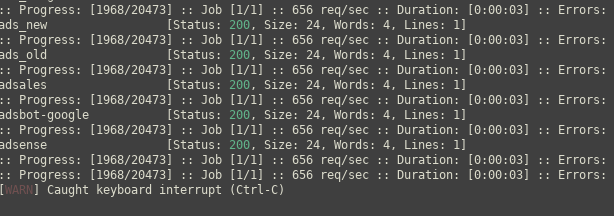

Web directory scanning

## ffuf

- ```ffuf -w path/to/wordlist -u https://fuff.io/FUZZ -e .php -c```

### Test parameters

- docker.com/test.php?FUZZ=blabla
- you'll find the size of normal request :




- here it s 24

- add ```-fs 24``` to hide the response with the length of 24

### vhost

- find the length of the non existent vhost :

```curl -s -H "Host: test.forwardslash.htb" http://forwardslash.htb | wc -c``` 

- filter on the size response

- and fuzz ```-H Host:FUZZ.forwardslash.htb -fs <size>```
- or ```Host: FUZZ.htb```
- or even ```Host: FUZZ.FUZZ``` 

### POST request

- Before trying to fuzz it, check the format of the content type, and put the same inside. Generally : ```-X POST -H "Content-Type: application/x-www-form-urlencoded"'```